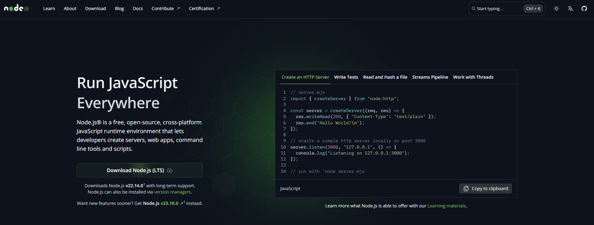
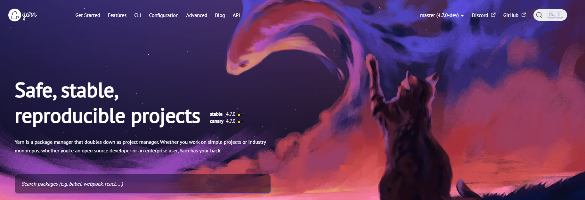
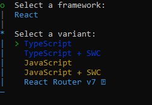
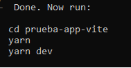
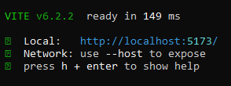
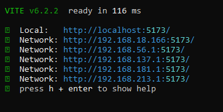
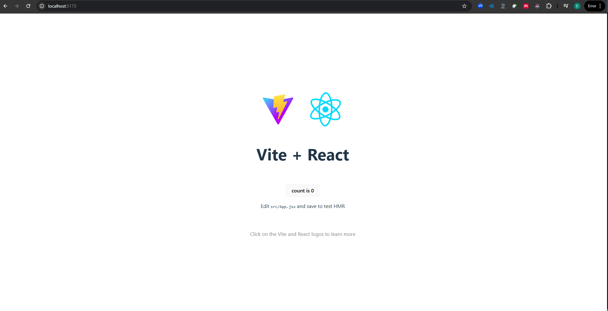
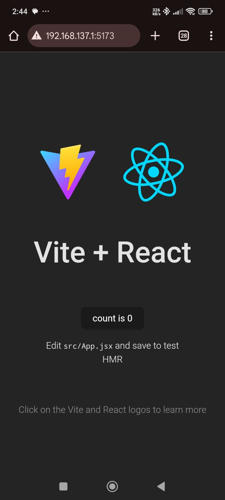

# Primeros_pasos_react
## 🔗Instalar NodeJS para tener npm
[Link de NodeJS](https://nodejs.org/en)

## 🔗Opcional -> Instalar yarn
Del mismo equipo creador de React


[Link de Yarn](https://yarnpkg.com/)

```bash
  npm install -g yarn
```
sudo en otros S.O
## Crear proyecto
Entra a la terminal y cambia de directorio hasta encontrar tu carpeta inicial
```bash
  yarn create create vite
```
Colocar el nombre de tu proyecto:
```bash
  Project name:
  nombre-de-tu-aplicacion
```
Seleccionas el framework a utilizar:
```bash
  Select framework:
  React
```


Seleccionas la variante a utilizar:
```bash
  Select a variant:
  Javascript
```


Resultado



## Correr el proyecto
Coloca la ruta de tu carpeta en cmd con:
```bash
  cd nombre-de-tu-aplicacion:
```
Ejecuta
```bash
  yarn
```
Luego
```bash
  yarn dev
```

## Correr el proyecto en pc y móvil
Repite los pasos de cd, yarn
```bash
  cd nombre-de-tu-aplicacion:
```
```bash
  yarn
```
Luego agrega el --host
```bash
  yarn dev --host
```


## Resultado final
Versión en PC


Versión móvil
